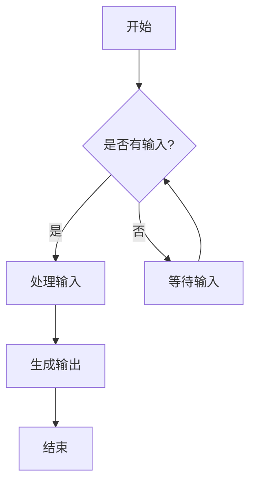

# Markdown 格式测试文档

这是一个用于测试博客系统 Markdown 渲染能力的综合测试文档。

## 文本格式测试

### 基础文本样式

这是普通文本。**这是粗体文本**。*这是斜体文本*。***这是粗斜体文本***。

~~这是删除线文本~~。`这是内联代码`。

### 链接测试

- [外部链接](https://github.com/moxin-org/mofa)
- [内部链接](/docs/quick-start)
- [带标题的链接](https://mofa.ai "MoFA 官方网站")

### 图片测试


## 标题层级测试

# 一级标题 H1
## 二级标题 H2  
### 三级标题 H3
#### 四级标题 H4
##### 五级标题 H5
###### 六级标题 H6

## 列表测试

### 无序列表

- 第一项
- 第二项
  - 嵌套项目 2.1
  - 嵌套项目 2.2
    - 深度嵌套 2.2.1
- 第三项

### 有序列表

1. 第一步
2. 第二步
   1. 子步骤 2.1
   2. 子步骤 2.2
3. 第三步

### 任务列表

- [x] 已完成的任务
- [ ] 待完成的任务
- [x] 另一个已完成的任务
- [ ] 另一个待完成的任务

## 代码块测试

### Python 代码

```python
def hello_world():
    """一个简单的Hello World函数"""
    print("Hello, MoFA!")
    
    # 创建一个简单的代理
    agent = Agent(
        name="greeter",
        prompt="你是一个友好的助手"
    )
    
    return agent.run("向世界问好")

# 调用函数
result = hello_world()
```

### JavaScript 代码

```javascript
// ES6 异步函数示例
const fetchData = async (url) => {
    try {
        const response = await fetch(url);
        const data = await response.json();
        return data;
    } catch (error) {
        console.error('获取数据失败:', error);
        throw error;
    }
};

// 使用示例
fetchData('/api/agents')
    .then(data => console.log(data))
    .catch(err => console.error(err));
```

### YAML 配置

```yaml
# MoFA Agent 配置示例
name: test-service
version: 1.0.0

# Service configuration
service:
  port: 8080
  host: localhost
  timeout: 30s

# Database settings
database:
  type: postgresql
  host: db.example.com
  port: 5432
  name: testdb
  user: admin
  max_connections: 100

# Cache configuration  
cache:
  enabled: true
  type: redis
  host: cache.example.com
  port: 6379
  ttl: 3600

# Monitoring
monitoring:
  enabled: true
  metrics:
    - cpu_usage
    - memory_usage
    - request_count
  alerts:
    - type: high_cpu
      threshold: 80
    - type: high_memory 
      threshold: 90

# Feature flags
features:
  new_ui: true
  beta_api: false
  dark_mode: true


```

## 引用测试

> 这是一个简单的引用块。
> 它可以包含多行内容。

> ### 引用中的标题
> 
> 引用块中也可以包含其他格式：
> 
> - 列表项目
> - **粗体文本**
> - `代码片段`
> 
> > 这是嵌套的引用块。

## 表格测试

### 简单表格

| 特性 | MoFA | 其他框架 |
|------|------|----------|
| 易用性 | ⭐⭐⭐⭐⭐ | ⭐⭐⭐ |
| 扩展性 | ⭐⭐⭐⭐⭐ | ⭐⭐⭐⭐ |
| 性能 | ⭐⭐⭐⭐ | ⭐⭐⭐ |
| 社区支持 | ⭐⭐⭐⭐ | ⭐⭐⭐⭐⭐ |

### 对齐表格

| 左对齐 | 居中对齐 | 右对齐 |
|:-------|:--------:|-------:|
| 文本 | 文本 | 文本 |
| 长一点的文本内容 | 居中显示的内容 | 999.99 |
| 短文本 | 中等长度的文本 | 42 |

## 分隔线测试

---

这是一条分隔线上方的内容。

***

这是另一条分隔线下方的内容。

___

还有一种分隔线样式。

## 特殊字符和符号

### Emoji 测试

🚀 🎯 💡 🔧 📚 ⚡ 🌟 🎨 🏆 💪

### 特殊符号

- 版权符号：© 2024
- 商标符号：MoFA™
- 注册商标：Python®
- 箭头：→ ← ↑ ↓ ⇒ ⇐
- 数学符号：± × ÷ ≠ ≤ ≥ ∞ √ ∑

## HTML 元素测试

### 键盘按键

按下 <kbd>Ctrl</kbd> + <kbd>C</kbd> 复制文本。

使用 <kbd>Cmd</kbd> + <kbd>V</kbd> 粘贴内容（Mac）。

### 高亮文本

这是一段包含 <mark>高亮文本</mark> 的句子。

### 上标和下标

水分子的化学式是 H<sub>2</sub>O。

爱因斯坦的质能方程是 E = mc<sup>2</sup>。

## 定义列表测试

MoFA
: Modular Framework for AI Agents，模块化 AI 代理框架

Agent
: 代理，在 MoFA 中指具有特定功能的 AI 单元

Pipeline
: 管道，用于连接和编排多个 Agent 的工作流

## 脚注测试

这是一个包含脚注的句子[^1]。

这是另一个脚注[^note]。

[^1]: 这是第一个脚注的内容。

[^note]: 这是命名脚注的内容，可以包含**格式化文本**和[链接](https://mofa.ai)。

## 数学公式测试（如果支持）

### 内联公式

这是一个内联数学公式：$E = mc^2$

### 块级公式

$$
\sum_{i=1}^{n} x_i = x_1 + x_2 + \cdots + x_n
$$

$$
\int_{0}^{\infty} e^{-x^2} dx = \frac{\sqrt{\pi}}{2}
$$

## 流程图测试（如果支持 Mermaid）



## 总结

这个测试文档包含了大部分常用的 Markdown 格式：

1. ✅ 标题层级（H1-H6）
2. ✅ 文本格式（粗体、斜体、删除线）
3. ✅ 列表（有序、无序、任务列表）
4. ✅ 链接和图片
5. ✅ 代码块（多种语言）
6. ✅ 引用块
7. ✅ 表格（简单和对齐）
8. ✅ 分隔线
9. ✅ HTML 元素
10. ✅ 特殊字符和 Emoji
11. ✅ 定义列表
12. ✅ 脚注
13. ⚠️ 数学公式（需要插件支持）
14. ⚠️ 流程图（需要 Mermaid 支持）

通过这个测试文档，我们可以验证博客系统对各种 Markdown 格式的渲染效果。 