# MoFA 架构深度解析：基于 Dora-RS 的下一代 AI 智能体框架

在 AI 智能体快速发展的今天，构建高性能、可扩展的智能体系统变得尤为重要。MoFA（**M**odular **F**ramework for **A**gent）作为新一代的智能体开发框架，基于高性能的 Dora-RS 数据流引擎，为开发者提供了一个独特的解决方案。本文将深入解析 MoFA 的技术架构，探讨其设计理念和技术优势。

## 🏗️ 整体架构设计



MoFA 与 Dora-RS 形成了完美的**分层互补**关系，构成了从底层硬件到上层 AI 应用的完整技术栈：

```
┌─────────────────────────────────────┐
│           MoFA 层                   │  ← AI智能体开发框架
│  智能体模板 + 组合逻辑 + AIOS服务    │     (Python为主)
├─────────────────────────────────────┤
│           Dora 层                   │  ← 高性能数据流引擎  
│  实时通信 + 跨语言 + 硬件抽象       │     (Rust核心)
└─────────────────────────────────────┘
```

## 🔧 MoFA 核心架构组件

### 1. 智能体构建框架 (Agent Build Framework)

这是 MoFA 的核心抽象层，提供了多种智能体设计模式：

#### **基础智能体 (Base Agent)**
```python
from mofa.agent_build.base.base_agent import MofaAgent
from dora import Node  # 直接集成 Dora

class MofaAgent:
    def __attrs_post_init__(self):
        self.node = Node(self.agent_name)  # 创建 Dora 节点
        
    def receive_parameter(self, parameter_name: str):
        for event in self.node:  # 使用 Dora 事件循环
            # MoFA 的智能体逻辑
            
    def send_output(self, output_name: str, result: Any):
        self.node.send_output(output_name, ...)  # 通过 Dora 发送
```

#### **智能体设计模式**
- **ReasonER**: 推理模式智能体，支持复杂的逻辑推理
- **CrewAI Integration**: 集成 CrewAI 的多智能体协作
- **Self Refine**: 自反思模式，支持输出的自我改进

### 2. 内核服务 (Kernel Services) - 迈向 AIOS

MoFA 提供了类似操作系统的核心服务，这些服务构成了 AI 操作系统 (AIOS) 的基础：

- **Memory**: 智能体记忆管理
- **Planning**: 任务规划和调度
- **RAG**: 检索增强生成
- **Tools**: 工具调用和管理

### 3. 智能体模板 (Agent Templates)

预构建的智能体模式，降低开发门槛：

```yaml
# 智能体模板配置示例
nodes:
  - id: reasoning-agent
    build: pip install -e ../../agent-hub/openai-agent
    path: openai-agent
    inputs:
      query: terminal-input/data
    outputs:
      - reasoning_result
```

### 4. 双重 Hub 生态

#### **Node Hub**: 扩展 Dora 生态
- `terminal-input` / `terminal-print`: 增强的 I/O 节点
- `dora-openai-server`: OpenAI API 服务集成
- `openai-server-stream`: 流式 AI 服务

#### **Agent Hub**: 40+ 预构建智能体
- `hello-world`: 基础示例智能体
- `openai-agent`: OpenAI 集成智能体
- `memory-agent`: 带记忆的智能体
- `kling-agent`: 视频生成智能体
- 更多专业智能体...

## ⚡ Dora-RS：高性能基础设施

### 核心架构层次

Dora-RS 为 MoFA 提供了工业级的性能基础：

```
dora/
├── binaries/              🚀 运行时组件
│   ├── cli/              # dora 命令行工具
│   ├── coordinator/      # 分布式协调器
│   ├── daemon/           # 后台守护进程
│   └── runtime/          # 数据流运行时
├── libraries/             🔧 底层核心库
│   ├── core/            # 核心调度引擎
│   ├── communication-layer/ # 通信层
│   ├── shared-memory-server/ # 共享内存服务
│   └── message/         # 基于 Apache Arrow 的消息系统
├── apis/                 🌐 多语言 API
│   ├── rust/ python/ c/ c++/  # 跨语言支持
└── node-hub/            📦 60+ 预构建节点
    ├── dora-yolo/       # YOLO 目标检测
    ├── dora-sam2/       # SAM2 分割
    ├── dora-qwen/       # Qwen 大语言模型
    └── ...              # AI/硬件节点生态
```

### 技术优势

1. **极致性能**: Rust + 共享内存 + Apache Arrow，比 ROS2 快 10-17 倍
2. **零拷贝通信**: 基于 Apache Arrow 的高效数据传输
3. **跨语言支持**: Python 智能体可与 Rust/C++ 硬件节点无缝协作
4. **实时数据流**: 毫秒级延迟的节点间通信

## 🔄 数据流驱动的设计哲学

### 数据流 vs 工作流

MoFA 选择了数据流驱动而非传统的工作流驱动方式：

```
传统AI框架 (工作流驱动):
Task → Rule → Step → Rule → Step → Result

MoFA+Dora (数据流驱动):
Data → Node → Data → Node → Data → Result
  ↑      ↑      ↑      ↑      ↑
  |   智能体   |   智能体   |
  └─────────Dora高性能通信──────┘
```

### 配置即代码

通过简单的 YAML 配置实现复杂的智能体组合：

```yaml
# hello_world_dataflow.yml
nodes:
  - id: terminal-input
    build: pip install -e ../../node-hub/terminal-input
    path: dynamic
    outputs: [data]
    inputs:
      agent_response: hello-world-agent/hello_world_result
      
  - id: hello-world-agent
    build: pip install -e ../../agent-hub/hello-world
    path: hello-world
    outputs: [hello_world_result]
    inputs:
      query: terminal-input/data
    env:
      IS_DATAFLOW_END: true
      WRITE_LOG: true
```

## 🔗 关键集成点分析

### 1. 基础智能体的 Dora 集成

MoFA 的每个智能体本质上都是一个 Dora 节点：

```python
# MoFA 智能体直接使用 Dora Node
from dora import Node

class MofaAgent:
    def __attrs_post_init__(self):
        self.node = Node(self.agent_name)  # 创建 Dora 节点
```

### 2. 生态系统的扩展关系

| 组件类型 | Dora原生 | MoFA扩展/使用 |
|----------|----------|---------------|
| 基础输入/输出 | `terminal-input`, `terminal-print` | ✓ 直接使用 |
| AI模型节点 | `dora-yolo`, `dora-qwen`, `dora-sam2` | ✓ 作为智能体组件 |
| MoFA专用 | - | `dora-openai-server`, `openai-server-stream` |
| 智能体类 | - | `agent-hub/*` (40+智能体) |

### 3. 数据流的无缝连接

通过 Dora 的数据流机制，MoFA 智能体可以：
- 与硬件设备直接通信
- 与 AI 模型节点实时交互
- 形成复杂的智能体网络

## 🎯 组合式 AI 的实现

### 智能体组合层次

```
SuperAgent (超级智能体)
    ↓
CompositeAgent (组合智能体)
    ↓
AtomicAgent (原子智能体)
    ↓
MofaAgent (基础智能体)
    ↓
Dora Node (Dora节点)
```

### 实际应用示例

```python
# 原子智能体示例
@run_agent
def run(agent: MofaAgent):
    user_query = agent.receive_parameter('query')
    # 处理逻辑
    agent.send_output('result', processed_data)

# 通过数据流组合成复杂应用
# input → reasoning_agent → memory_agent → output
```

## 🚀 性能优势与技术创新

### 1. 高性能基础
- **Rust 内核**: 内存安全 + 零成本抽象
- **共享内存**: 避免数据拷贝开销
- **Apache Arrow**: 列式内存格式，高效序列化

### 2. 开发效率
- **零代码组合**: YAML 配置完成复杂应用
- **模板生态**: 预构建的智能体和模式
- **跨语言**: 一套框架，多种语言

### 3. 可扩展性
- **分布式**: 天然支持分布式部署
- **模块化**: 松耦合的组件设计
- **生态丰富**: 60+ Dora 节点 + 40+ MoFA 智能体

## 🔮 面向未来的 AI 操作系统

MoFA 的愿景是构建真正的 AI 操作系统 (AIOS)：

- **内核服务**: Memory、Planning、RAG、Tools
- **应用层**: 智能体模板和预构建应用
- **Shell**: 数据流配置和编排环境
- **生态系统**: 开放的节点和智能体市场

## 📈 实际应用场景

### 1. 机器人控制
```
Camera → YOLO → Path Planning → Motor Control
   ↓        ↓         ↓           ↓
 视觉输入 → 目标检测 → 路径规划 → 动作执行
```

### 2. 多模态 AI 应用
```
Text/Image → VLM → Reasoning → Action
     ↓        ↓       ↓        ↓
   多模态输入 → 理解 → 推理 → 执行
```

### 3. 智能客服系统
```
Voice → STT → LLM → TTS → Speaker
  ↓      ↓     ↓     ↓      ↓
语音输入 → 转文字 → 理解回答 → 转语音 → 播放
```

## 🎉 总结

MoFA 基于 Dora-RS 构建了一个独特的智能体开发框架，它不仅提供了：

1. **高性能基础**: 基于 Rust 的极致性能
2. **简化开发**: 模板化的智能体构建
3. **灵活组合**: 数据流驱动的组合方式
4. **丰富生态**: 预构建的节点和智能体库
5. **面向未来**: AIOS 的技术基础

这种**分层架构**使得开发者可以专注于业务逻辑，而无需关心底层的性能优化，同时系统又能获得工业级的性能表现。

随着 AI 技术的快速发展，MoFA 为构建下一代智能体应用提供了一个强大而灵活的平台。无论是简单的对话机器人，还是复杂的多模态 AI 系统，MoFA 都能提供合适的解决方案。

---

**想了解更多？**
- 📚 [快速开始指南](/docs/quick-start)
- 🛠️ [智能体开发教程](/docs/agent-development)
- 🌟 [GitHub 仓库](https://github.com/moxin-org/mofa)
- 💬 [加入社区讨论](https://discord.gg/mofa) 