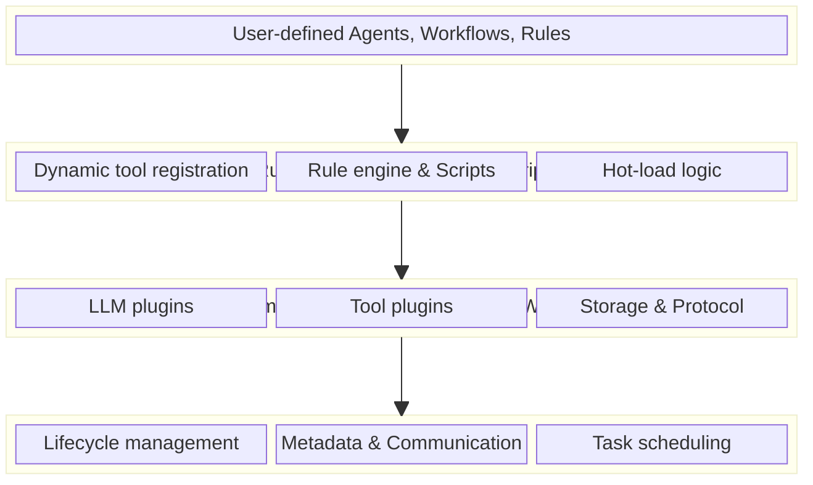

# Microkernel Architecture

MoFA adopts a **layered microkernel architecture** with `mofa-kernel` at its core. All other features (including the dual-layer plugin system, LLM capabilities, multi-agent collaboration, etc.) are built as modular components on top of the microkernel.

## Core Design Principles

- **Core Simplicity**: The microkernel contains only the most basic functions: agent lifecycle management, metadata system, and dynamic management.
- **High Extensibility**: All advanced features are extended through modular components and plugins, keeping the kernel incredibly stable.
- **Loose Coupling**: Components communicate through standardized interfaces, making them easy to replace and upgrade.

## Visual Architecture Overview

## Agent Coordination via the Microkernel

The kernel handles complex coordination seamlessly without bloating the framework:

- **Priority Scheduling**: Task scheduling system based on strict priority levels.
- **Communication Bus**: A built-in inter-agent communication bus allows seamless interactions via the `SimpleMessageBus` or `DoraChannel`.
- **Workflow Engine**: Powers the core engine behind visual workflow builders and complex LLM agent collaborations.
